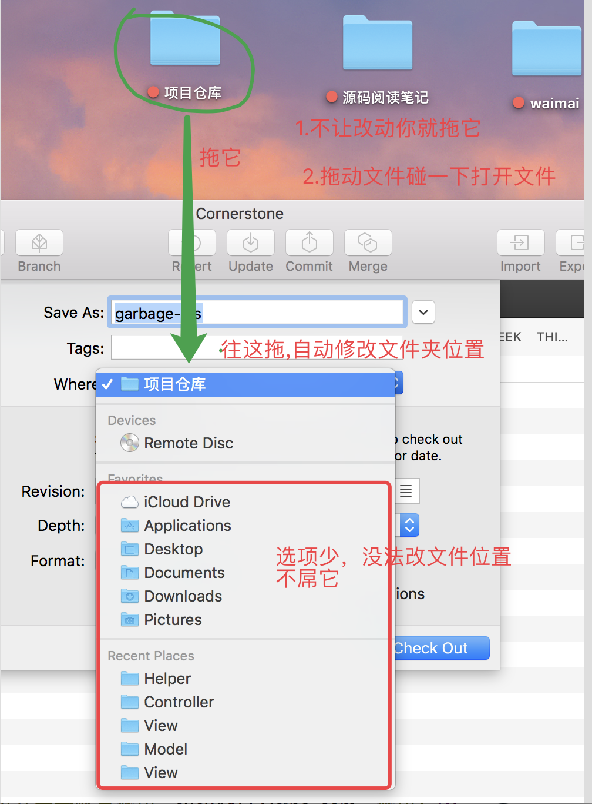
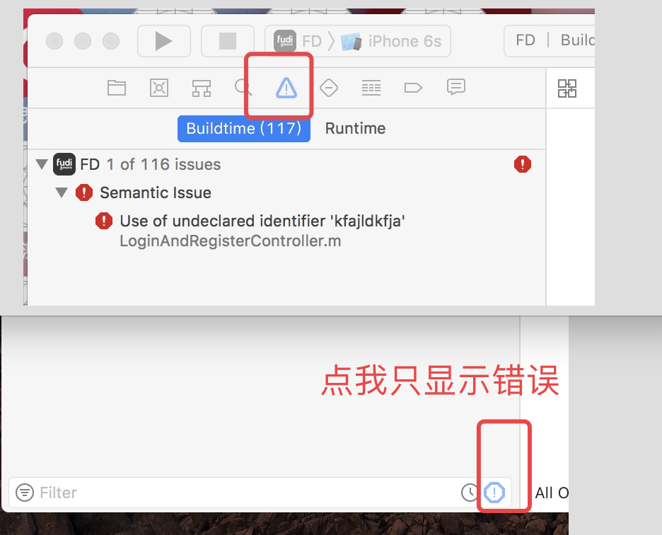
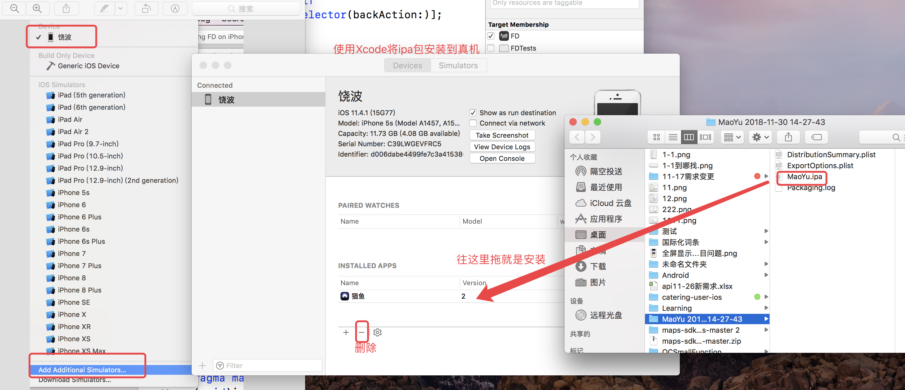

The user Of Xcode 

## 二 Mac 使用技巧

### 1.Mac使用技巧:拖一下碰一下




## 一 xcode的使用

```
需求：

搜索关键字: 

设置:

效果截图:
```


会总结的人是幸福的人。

### 1.只显示错误

```
需求：编译报错的时候,警告⚠️和错误❌混在一起，有没有办法只显示报错？？？

搜索关键字: ``Xcode Buildtime``

设置: 左边 三角形叹号，左边角，点击8八边形叹号，只显示错误。
```


效果截图:



### 2.修改类名:

#### 2-1拓展1

#### 2-1拓展2

###3.升级Xcode10.0后不提示问题:

```
需求：

搜索关键字: 

设置:
1.Xcode-->File -->Workspace Settings -->弹出页面
2.在弹出的页面中 找到最上面的 Shared Workspace Settings:
3.将 Build System：改为 Legacy(遗产) Build System
4.最好重启Xcode
效果截图:
```

### 4.使用Xcode将ipa包安装到真机

```
步骤：1.连接真机，点击真机-->然后点击Add Additional Simulators... --->会弹出一个界面。
2.找到ipa包拖到 INSTALLED APPS 区域-->安装成功
3.点击 "-" 按钮删除安装的app

如何找到曾经打包过的ipa包: 
Xcode-->Window-->Organizer -->会弹出一个界面，所有曾经打包过的包都在这里。

```

截图：




### 5.统计代码行数

总结：

```
语法总结: 1. -name "*.m" //表示文件后缀，如果有多个就使用 -or -name "*.文件后缀" 进行拼接
2. 主干
find . "(" -name "*.xxxx后缀" ")"  -print | xargs wc -l
3.注意空格。
```

示例:

```
//最简易
find . "(" -name "*.m" ")" -print | xargs wc -l

//扩展1
find . "(" -name "*.m" -or -name "*.h" ")" -print | xargs wc -l

//扩展2
find . "(" -name "*.swift" ")" -print | xargs wc -l
```


